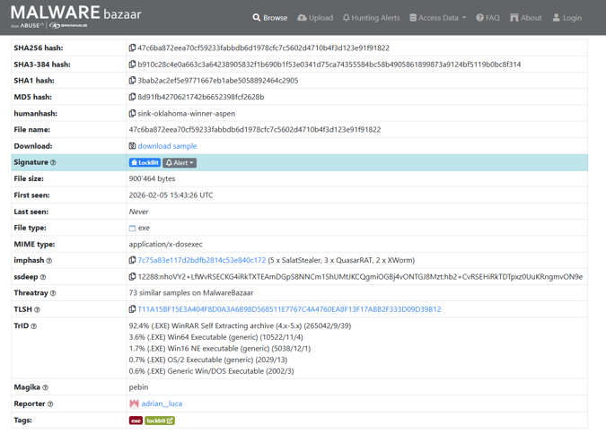
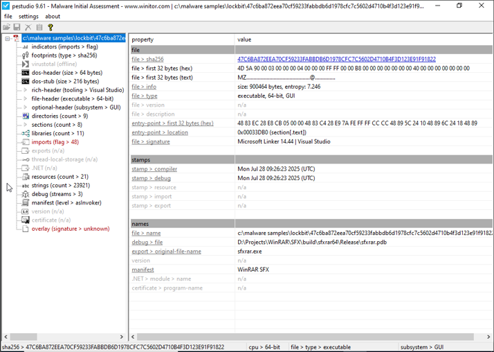
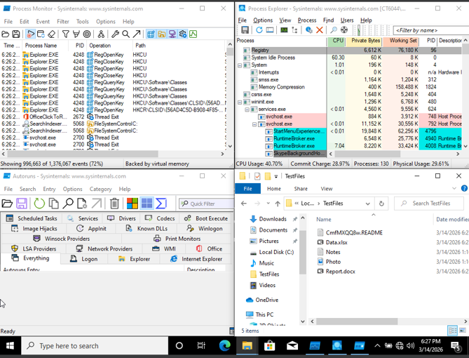
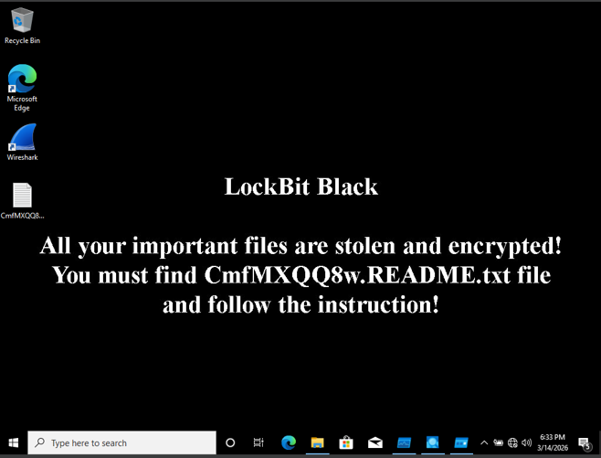
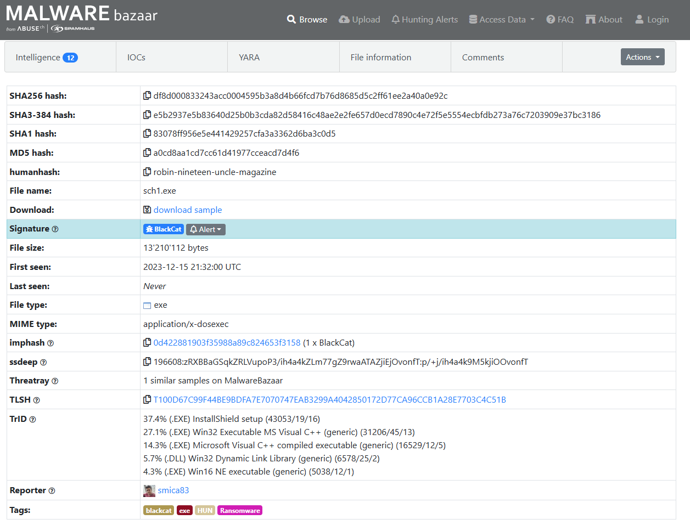
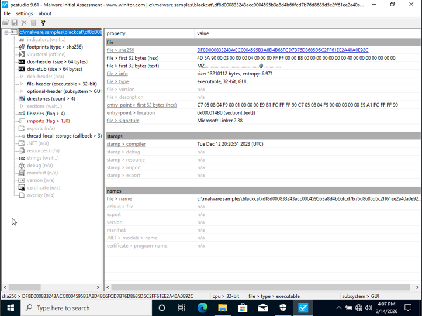
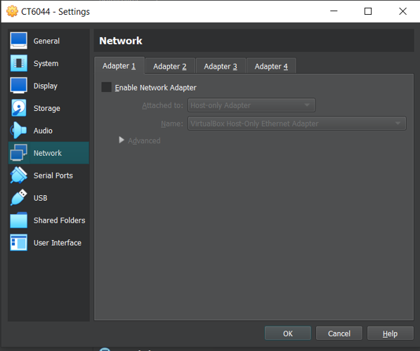
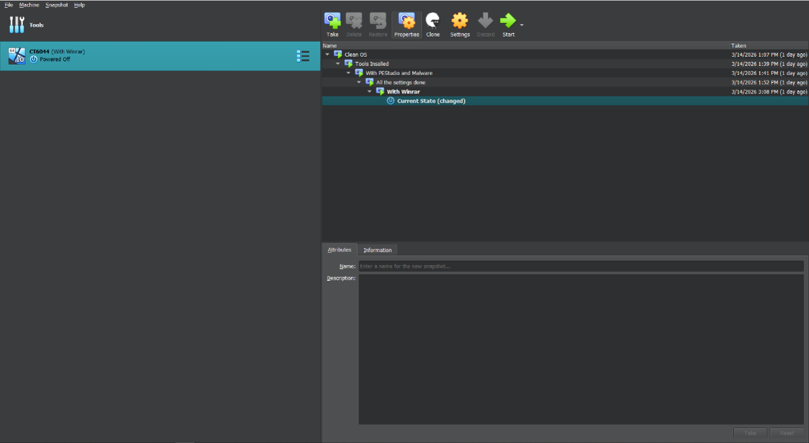

# Investigation Evidence

This directory contains selected screenshots from the original controlled LockBit and BlackCat (ALPHV) ransomware investigation.

The evidence was selected to demonstrate the analysis environment, sample identification, static analysis, dynamic observation, and visible ransomware effects without distributing executable malware.

> **Evidence standard:** Screenshots are interpreted only within what they visibly demonstrate. Broader ransomware capabilities documented through threat intelligence are not presented as laboratory observations.

---

## 01 — LockBit Sample Identification

**Source:** MalwareBazaar

The screenshot records the sample used during the LockBit investigation and provides identifying metadata including cryptographic hashes, file information, and MalwareBazaar classification.

**Demonstrates:**
- Provenance of the analysed sample
- Sample-identification metadata
- LockBit classification associated with the sample

**Does not demonstrate:**
- Runtime behaviour
- Network propagation
- Lateral movement
- Successful encryption

---

## 02 — LockBit Static Analysis

**Tool:** PEStudio

PEStudio was used to inspect the LockBit sample without relying solely on execution behaviour.

The screenshot records PE characteristics and binary metadata used during the static-analysis phase.

**Demonstrates:**
- Portable Executable inspection
- Binary metadata analysis
- PEStudio-based static-analysis workflow
- Structural characteristics of the analysed sample

Static characteristics should be interpreted as indicators and not automatically as proof that a capability executed dynamically.

---

## 03 — LockBit Dynamic Analysis

**Tools visible:** Process Monitor, Process Explorer, Autoruns, Windows File Explorer

This screenshot captures the controlled monitoring environment used during LockBit execution.

Process Monitor and Process Explorer provided visibility into system and process activity while File Explorer was used to inspect the prepared test-file environment and resulting artefacts.

**Demonstrates:**
- Dynamic-analysis environment
- Process and system monitoring
- File-system observation
- Use of multiple Sysinternals tools during the investigation
- Presence of a ransomware-related artefact in the test-file environment

The screenshot should not be interpreted as proof of enterprise lateral movement or network propagation.

---

## 04 — LockBit Wallpaper Modification

Following execution, the Windows desktop displayed a LockBit Black message directing the victim toward a generated ransom-note file.

**Demonstrates:**
- Successful execution producing a visible system modification
- Desktop wallpaper modification
- Creation/reference of a ransomware note
- Post-execution extortion artefact

This is one of the clearest visual indicators of the ransomware's observed impact inside the isolated VM.

---

## 05 — BlackCat Sample Identification

**Source:** MalwareBazaar

The screenshot records identifying information for the BlackCat (ALPHV) sample used during the investigation.

**Demonstrates:**
- Provenance of the analysed sample
- Cryptographic sample identifiers
- File metadata
- BlackCat classification associated with the sample

**Does not demonstrate:**
- Runtime behaviour
- Data exfiltration
- Lateral movement
- Linux or ESXi execution

---

## 06 — BlackCat Static Analysis

**Tool:** PEStudio

The screenshot documents static inspection of the BlackCat sample.

The analysis examined executable properties, PE characteristics, imports, libraries, strings, and other binary indicators.

**Demonstrates:**
- PEStudio-based static analysis
- Windows executable inspection
- Binary metadata and structural analysis
- Static capability investigation

As with the LockBit analysis, static indicators are not treated as proof that every identified capability occurred during execution.

---

## 07 — Isolated VM Network Configuration

**Platform:** Oracle VM VirtualBox

The VirtualBox configuration shows the virtual machine's network adapter disabled for the malware-execution environment.

**Demonstrates:**
- Network isolation during malware execution
- Controlled laboratory configuration
- A safety measure designed to prevent communication with external infrastructure

Because networking was disabled, this experiment does not claim to have observed command-and-control communication, external data exfiltration, or internet-based propagation.

---

## 08 — Analysis VM Snapshots

**Platform:** Oracle VM VirtualBox

Snapshots were used throughout the laboratory workflow to preserve clean analysis states and support restoration after malware execution.

**Demonstrates:**
- Snapshot-based laboratory workflow
- Repeatable restoration points
- Separation of analysis stages
- Controlled malware-analysis methodology

Snapshots allowed the VM to be returned to a known state after testing.

---

## Evidence Summary

| Evidence | Category | Primary Purpose |
| --- | --- | --- |
| 01 | Sample provenance | LockBit identification |
| 02 | Static analysis | LockBit PE inspection |
| 03 | Dynamic analysis | LockBit runtime monitoring |
| 04 | Impact evidence | LockBit wallpaper/ransomware artefact |
| 05 | Sample provenance | BlackCat identification |
| 06 | Static analysis | BlackCat PE inspection |
| 07 | Lab safety | Network isolation |
| 08 | Lab methodology | Snapshot workflow |

---

## Evidence Limitations

The investigation was conducted in an isolated, single-host Windows virtual machine.

The evidence therefore does **not** independently demonstrate:

- Enterprise network propagation
- Multi-host lateral movement
- Credential theft across an organisation
- Command-and-control communication
- External data exfiltration
- Linux execution
- ESXi execution
- Every capability associated with LockBit or BlackCat in public threat intelligence

Where these behaviours are discussed elsewhere in the repository, they are identified as contextual threat-intelligence information rather than direct experimental observations.

---

## Safety Notice

These screenshots are retained for defensive cybersecurity education and portfolio documentation.

No executable ransomware, malicious payloads, password-protected malware archives, credentials, victim data, or operational attacker infrastructure are distributed through this repository.
